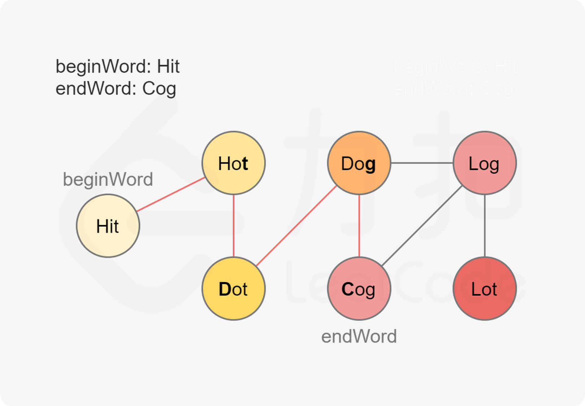

写了很久发现还是不会。。应该就是一道BFS，我太水了。。好好加油吧！！！

给定两个单词（beginWord 和 endWord）和一个字典，找到从 beginWord 到 endWord 的最短转换序列的长度。转换需遵循如下规则：

1. 每次转换只能改变一个字母。

2. 转换过程中的中间单词必须是字典中的单词。

   说明:

- 如果不存在这样的转换序列，返回 0。
- 所有单词具有相同的长度。
- 所有单词只由小写字母组成。
- 字典中不存在重复的单词。
- 你可以假设 beginWord 和 endWord 是非空的，且二者不相同。

```
输入:
beginWord = "hit",
endWord = "cog",
wordList = ["hot","dot","dog","lot","log","cog"]

输出: 5

解释: 一个最短转换序列是 "hit" -> "hot" -> "dot" -> "dog" -> "cog",返回它的长度 5。

```

基于该图，我们以 `beginWord` 为图的起点，以 `endWord` 为终点进行**广度优先搜索**，寻找 `beginWord` 到 `endWord` 的最短路径。



```java
import java.util.ArrayList;
import java.util.Collections;
import java.util.HashSet;
import java.util.LinkedList;
import java.util.List;
import java.util.Queue;
import java.util.Set;

public class Solution {

    public int ladderLength(String beginWord, String endWord, List<String> wordList) {
        // 第 1 步：先将 wordList 放到哈希表里，便于判断某个单词是否在 wordList 里
        Set<String> wordSet = new HashSet<>(wordList);
        if (wordSet.size() == 0 || !wordSet.contains(endWord)) {
            return 0;
        }
        wordSet.remove(beginWord);
        
        // 第 2 步：图的广度优先遍历，必须使用队列和表示是否访问过的 visited 哈希表
        Queue<String> queue = new LinkedList<>();
        queue.offer(beginWord);
        Set<String> visited = new HashSet<>();
        visited.add(beginWord);
        
        // 第 3 步：开始广度优先遍历，包含起点，因此初始化的时候步数为 1
        int step = 1;
        while (!queue.isEmpty()) {
            int currentSize = queue.size();
            for (int i = 0; i < currentSize; i++) {
                // 依次遍历当前队列中的单词
                String currentWord = queue.poll();
                // 如果 currentWord 能够修改 1 个字符与 endWord 相同，则返回 step + 1
                if (changeWordEveryOneLetter(currentWord, endWord, queue, visited, wordSet)) {
                    return step + 1;
                }
            }
            step++;
        }
        return 0;
    }

    /**
     * 尝试对 currentWord 修改每一个字符，看看是不是能与 endWord 匹配
     *
     * @param currentWord
     * @param endWord
     * @param queue
     * @param visited
     * @param wordSet
     * @return
     */
    private boolean changeWordEveryOneLetter(String currentWord, String endWord,
                                             Queue<String> queue, Set<String> visited, Set<String> wordSet) {
        char[] charArray = currentWord.toCharArray();
        for (int i = 0; i < endWord.length(); i++) {
            // 先保存，然后恢复
            char originChar = charArray[i];
            for (char k = 'a'; k <= 'z'; k++) {
                if (k == originChar) {
                    continue;
                }
                charArray[i] = k;
                String nextWord = String.valueOf(charArray);
                if (wordSet.contains(nextWord)) {
                    if (nextWord.equals(endWord)) {
                        return true;
                    }
                    if (!visited.contains(nextWord)) {
                        queue.add(nextWord);
                        // 注意：添加到队列以后，必须马上标记为已经访问
                        visited.add(nextWord);
                    }
                }
            }
            // 恢复
            charArray[i] = originChar;
        }
        return false;
    }
}
```

