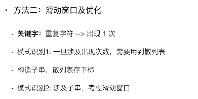

> 给定一个字符串，请你找出其中不含有重复字符的 **最长子串** 的长度。

```
输入: "abcabcbb"
输出: 3 
解释: 因为无重复字符的最长子串是 "abc"，所以其长度为 3。
```

如果不用暴力解法的话，我是不会做的了。所以直接看题解。




 核心思想：

- 如果set中没有出现下一个元素，则将该元素包含进来。
- 如果set中出现了下一个元素的值，则将左邻接收缩到上一次出现该值的位置。

```java
class Solution {
    public int lengthOfLongestSubstring(String s) {
        int n = s.length(), result = 0;
        HashMap<Character, Integer> map = new HashMap<>();
        // start end 是滑动窗口的左右边
        for (int end = 0, start = 0; end < n; end++) {
            char c = s.charAt(end);
            if (map.containsKey(c)) {
                start = Math.max(map.get(c), start);
            }
            result = Math.max(result, end - start + 1);
            map.put(c, end + 1);
        }
        return result;
    }
}
```


[滑动窗口的一些模板](https://leetcode-cn.com/problems/longest-substring-without-repeating-characters/solution/hua-dong-chuang-kou-by-powcai/)

