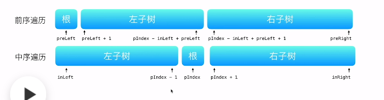

```java
//主要是找好下标
class Solution {
    public TreeNode buildTree(int[] preorder, int[] inorder) {
        if (preorder.length == 0) return null;
        return helper(preorder, inorder, 0, preorder.length - 1, 0, inorder.length - 1);
    }

    public TreeNode helper(int[] preorder, int[] inorder, int preStart, int preEnd, int inStart, int inEnd) {
        if (preEnd < preStart || inEnd < inStart) return null;
        int val = preorder[preStart];
        TreeNode newNode = new TreeNode(val);
        System.out.println(val);
        int index = 0;
        for (int i = inStart; i <= inEnd; i++) {
            if (inorder[i] == val) {
                index = i;
                break;
            }
        }
        newNode.left = helper(preorder, inorder, preStart + 1, index - inStart + preStart, inStart, index - 1);
        newNode.right = helper(preorder, inorder, index - inStart + preStart + 1, preEnd, index + 1, inEnd);
        return newNode;
    }
}
```

