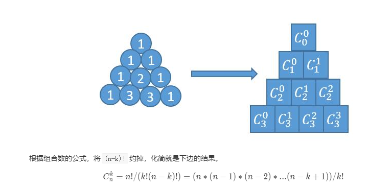

# 杨辉三角II




```java
//感觉有点累了？这才第二周，天！
class Solution {
    public List<Integer> getRow(int rowIndex) {
        List<Integer> ans = new ArrayList<>();
        int N = rowIndex;
        long pre = 1;
        ans.add(1);
        for (int k = 1; k <= N; k++) {
            if (k <= (N + 1) / 2) {
                long cur = pre * (N - k + 1) / k;    //pre 就是前一步算得了
                ans.add((int) cur);
                pre = cur;
            } else {
                ans.add(ans.get(N - k));
            }

        }
        return ans;
    }
}
```