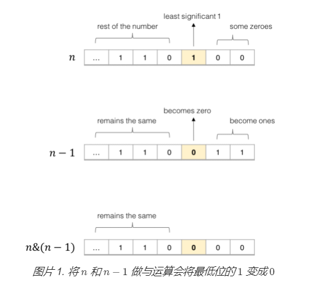

```java
public class Solution {
    public int hammingWeight(int n) {
        int bits = 0;
        int mask = 1;
        for (int i = 0; i < 32; i++) {
            if ((n & mask) != 0) {
                bits++;
            }
            mask <<= 1;
        }
        return bits;
    }
}
```


我们可以把前面的算法进行优化。我们不再检查数字的每一个位，而是不断把数字最后一个 1 反转，并把答案加一。当数字变成 0 的时候偶，我们就知道它没有 1 的位了，此时返回答案。


这里关键的想法是对于任意数字 n ，将 n 和 n - 1 做与运算，会把最后一个 1 的位变成 0



```java
public int hammingWeight(int n) {
    int sum = 0;
    while (n != 0) {
        sum++;
        n &= (n - 1);
    }
    return sum;
}

```

